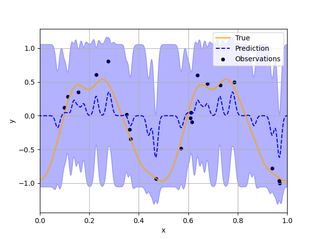
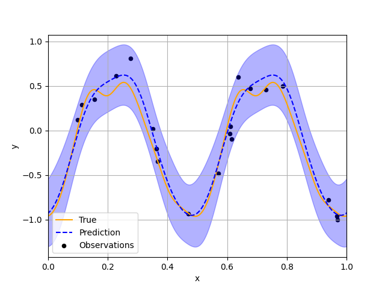
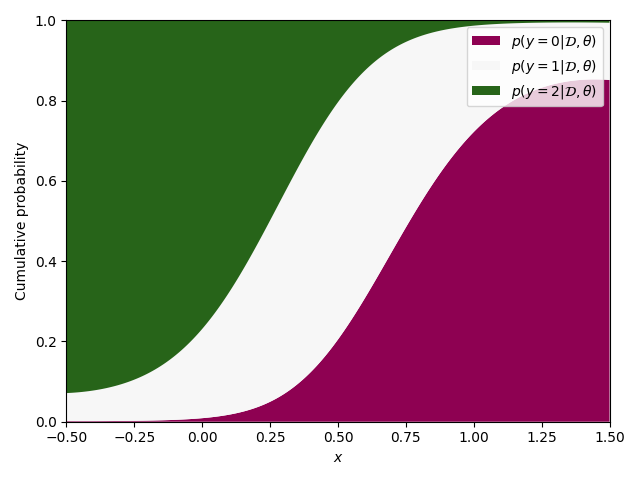
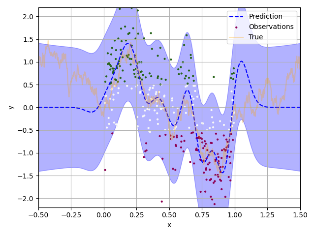
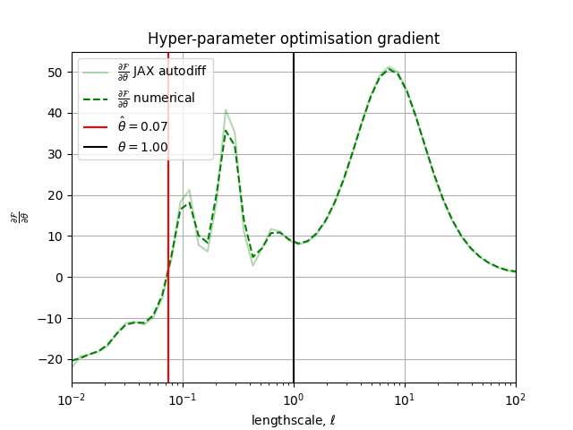

# [probit](http://github.com/bb515/probit)
[](https://github.com/bb515/diffusionjax/actions/workflows/CI.yml)
[](https://coveralls.io/github/bb515/diffusionjax?branch=master)
[](https://github.com/psf/black)


probit is a simple and accessible Gaussian process package in JAX. Thank you to [nPlan](https://www.nplan.io/), who are supporting this project.

probit uses [MLKernels](https://github.com/wesselb/mlkernels) for the GP prior, see the available [means](https://github.com/wesselb/mlkernels#available-means) and [kernels](https://github.com/wesselb/mlkernels#available-kernels) with [compositional design](https://github.com/wesselb/mlkernels#compositional-design).

Contents:

- [Installation](#installation)
- [Examples](#examples)
    - [Regression and hyperparameter optimization](#regression-and-hyperparameter-optimization)
    - [Ordinal regression and hyperparameter optimization](#ordinal-regression-and-hyperparameter-optimization)
- [Doesn't haves](#doesnt-haves)
- [References](#references)

TLDR:
```python
>>> from probit.approximators import LaplaceGP as GP
>>> from probit.utilities import log_gaussian_likelihood
>>> from mlkernels import EQ
>>>
>>> def prior(prior_parameters):
>>>     lengthscale, signal_variance = prior_parameters
>>>     # Here you can define the kernel that defines the Gaussian process
>>>     return signal_variance * EQ().stretch(lengthscale).periodic(0.5)
>>>
>>> gaussian_process = GP(data=(X, y), prior=prior, log_likelihood=log_gaussian_likelihood)
>>> likelihood_parameters = 1.0
>>> prior_parameters = (1.0, 1.0)
>>> parameters = (prior_parameters, likelihood_parameters)
>>> weight, precision = gaussian_process.approximate_posterior(parameters)
>>> predictive_mean, predictive_variance = gaussian_process.predict(
>>>     X_test,
>>>     parameters, weight, precision)
```

## Installation
The package requires Python 3.8+. First, it is recommended to [create a new python virtual environment](https://conda.io/projects/conda/en/latest/user-guide/tasks/manage-environments.html#creating-an-environment-with-commands). 
probit depends on JAX. Because the JAX installation is different depending on your CUDA version, probit does not list JAX as a dependency in `setup.py`.
First, [follow these instructions](https://github.com/google/jax#installation) to install JAX with the relevant accelerator support.
Then, `pip install probit` or for developers,
- Clone the repository `git clone git@github.com:bb515/probit.git`
- Install using pip `pip install -e .` from the root directory of the repository (see the `setup.py` for the requirements that this command installs)

## Examples
You can find examples of how to use the package under:`examples/`.

### Regression and hyperparameter optimization
Run the regression example by typing `python examples/regression.py`.
```python
>>> def prior(prior_parameters):
>>>     lengthscale, signal_variance = prior_parameters
>>>     # Here you can define the kernel that defines the Gaussian process
>>>     return signal_variance * EQ().stretch(lengthscale).periodic(0.5)
>>>
>>> # Generate data
>>> key = random.PRNGKey(0)
>>> noise_std = 0.2
>>> (X, y, X_show, f_show, N_show) = generate_data(
>>>     key, N_train=20,
>>>     kernel=prior((1.0, 1.0)), noise_std=noise_std,
>>>     N_show=1000)
>>>
>>> gaussian_process = GP(data=(X, y), prior=prior, log_likelihood=log_gaussian_likelihood)
>>> evidence = gaussian_process.objective()
>>>
>>> vs = Vars(jnp.float32)
>>>
>>> def model(vs):
>>>     p = vs.struct
>>>     return (p.lengthscale.positive(), p.signal_variance.positive()), (p.noise_std.positive(),)
>>>
>>> def objective(vs):
>>>     return evidence(model(vs))
>>>
>>> # Approximate posterior
>>> parameters = model(vs)
>>> weight, precision = gaussian_process.approximate_posterior(parameters)
>>> mean, variance = gaussian_process.predict(
>>>     X_show, parameters, weight, precision)
>>> noise_variance = vs.struct.noise_std()**2
>>> obs_variance = variance + noise_variance
>>> plot((X, y), (X_show, f_show), mean, variance, fname="readme_regression_before.png")
```

```python
>>> print("Before optimization, \nparams={}".format(parameters))
```
Before optimization, 
params=((Array(0.10536897, dtype=float32), Array(0.2787192, dtype=float32)), (Array(0.6866876, dtype=float32),))
```python
>>> minimise_l_bfgs_b(objective, vs)
>>> parameters = model(vs)
>>> print("After optimization, \nparams={}".format(parameters))
```
After optimization, 
params=((Array(1.354531, dtype=float32), Array(0.48594338, dtype=float32)), (Array(0.1484054, dtype=float32),))
```python
>>> # Approximate posterior
>>> weight, precision = gaussian_process.approximate_posterior(parameters)
>>> mean, variance = gaussian_process.predict(
>>>     X_show, parameters, weight, precision)
>>> noise_variance = vs.struct.noise_std()**2
>>> obs_variance = variance + noise_variance
>>> plot((X, y), (X_show, f_show), mean, obs_variance, fname="readme_regression_after.png")
```


### Ordinal regression and hyperparameter optimization
Run the ordinal regression example by typing `python examples/classification.py`.

```python
>>> # Generate data
>>> J = 3  # use a value of J=2 for GP binary classification
>>> key = random.PRNGKey(1)
>>> noise_variance = 0.4
>>> signal_variance = 1.0
>>> lengthscale = 1.0
>>> kernel = signal_variance * Matern12().stretch(lengthscale)
>>> (N_show, X, g_true, y, cutpoints,
>>> X_test, y_test,
>>> X_show, f_show) = generate_data(key,
>>>     N_train_per_class=10, N_test_per_class=100,
>>>     J=J, kernel=kernel, noise_variance=noise_variance,
>>>     N_show=1000, jitter=1e-6)
>>>
>>> # Initiate a misspecified model, using a kernel
>>> # other than the one used to generate data
>>> def prior(prior_parameters):
>>>     # Here you can define the kernel that defines the Gaussian process
>>>     return signal_variance * EQ().stretch(prior_parameters)
>>>
>>> classifier = Approximator(data=(X, y), prior=prior,
>>>     log_likelihood=log_probit_likelihood,
>>>     tolerance=1e-5  # tolerance for the jaxopt fixed-point resolution
>>>     )
>>> negative_evidence_lower_bound = classifier.objective()
>>>
>>> vs = Vars(jnp.float32)
>>>
>>> def model(vs):
>>>     p = vs.struct
>>>     noise_std = jnp.sqrt(noise_variance)
>>>     return (p.lengthscale.positive(1.2)), (noise_std, cutpoints)
>>>
>>> def objective(vs):
>>>     return negative_evidence_lower_bound(model(vs))
>>>
>>> # Approximate posterior
>>> parameters = model(vs)
>>> weight, precision = classifier.approximate_posterior(parameters)
>>> mean, variance = classifier.predict(
>>>     X_show,
>>>     parameters,
>>>     weight, precision)
>>> obs_variance = variance + noise_variance
>>> predictive_distributions = probit_predictive_distributions(
>>>     parameters[1],
>>>     mean, variance)
>>> plot(X_show, predictive_distributions, mean,
>>>     obs_variance, X_show, f_show, X, y, g_true,
>>>     J, colors, fname="readme_classification_before")
```



```python
>>> # Evaluate model
>>> mean, variance = classifier.predict(
>>>     X_test,
>>>     parameters,
>>>     weight, precision)
>>> predictive_distributions = probit_predictive_distributions(
>>>     parameters[1],
>>>     mean, variance)
>>> print("\nEvaluation of model:")
>>> calculate_metrics(y_test, predictive_distributions)
>>> print("Before optimization, \nparameters={}".format(parameters))
```
Evaluation of model:\
116 sum incorrect\
184 sum correct\
mean_absolute_error=0.41\
log_pred_probability=-140986.54\
mean_zero_one_error=0.39

Before optimization, 
parameters=(Array(1.2, dtype=float32), (Array(0.63245553, dtype=float64, weak_type=True), Array([       -inf, -0.54599167,  0.50296235,         inf], dtype=float64)))
```python
>>> minimise_l_bfgs_b(objective, vs)
>>> parameters = model(vs)
>>> print("After optimization, \nparameters={}".format(model(vs)))
```
After optimization, 
parameters=(Array(0.07389855, dtype=float32), (Array(0.63245553, dtype=float64, weak_type=True), Array([       -inf, -0.54599167,  0.50296235,         inf], dtype=float64)))
```python
>>> # Approximate posterior
>>> parameters = model(vs)
>>> weight, precision = classifier.approximate_posterior(parameters)
>>> mean, variance = classifier.predict(
>>>     X_show,
>>>     parameters,
>>>     weight, precision)
>>> predictive_distributions = probit_predictive_distributions(
>>>     parameters[1],
>>>     mean, variance)
>>> plot(X_show, predictive_distributions, mean,
>>>     obs_variance, X_show, f_show, X, y, g_true,
>>>     J, colors, fname="readme_classification_after")
```


```python
>>> # Evaluate model
>>> mean, variance = classifier.predict(
>>>     X_test,
>>>     parameters,
>>>     weight, precision)
>>> obs_variance = variance + noise_variance
>>> predictive_distributions = probit_predictive_distributions(
>>>     parameters[1],
>>>     mean, variance)
>>> print("\nEvaluation of model:")
>>> calculate_metrics(y_test, predictive_distributions)
```
Evaluation of model:\
106 sum incorrect\
194 sum correct\
mean_absolute_error=0.36\
log_pred_probability=-161267.49\
mean_zero_one_error=0.35
```python
>>> nelbo = lambda x : negative_evidence_lower_bound(((x), (jnp.sqrt(noise_variance), cutpoints)))
>>> fg = vmap(value_and_grad(nelbo))
>>>
>>> domain = ((-2, 2), None)
>>> resolution = (50, None)
>>> x = jnp.logspace(
>>>     domain[0][0], domain[0][1], resolution[0])
>>> xlabel = r"lengthscale, $\ell$"
>>> xscale = "log"
>>> phis = jnp.log(x)
>>>
>>> fgs = fg(x)
>>> fs = fgs[0]
>>> gs = fgs[1]
>>> plot_obj(vs.struct.lengthscale(), lengthscale, x, fs, gs, domain, xlabel, xscale)
```



## Doesn't haves
- [Variational Gaussian Process](https://gpflow.readthedocs.io/en/v1.5.1-docs/notebooks/theory/vgp_notes.html) or [Sparse Variational Gaussian Process](https://gpflow.readthedocs.io/en/v1.5.1-docs/notebooks/theory/SGPR_notes.html).

## References
Algorithms in this package were ported from pre-existing code. In particular, the code was ported from the following papers and repositories:

Laplace approximation http://www.gatsby.ucl.ac.uk/~chuwei/ordinalregression.html\
@article{Chu2005,\
author = {Chu, Wei and Ghahramani, Zoubin},\
year = {2005},\
month = {07},\
pages = {1019-1041},\
title = {Gaussian Processes for Ordinal Regression.},\
volume = {6},\
journal = {Journal of Machine Learning Research},\
howpublished = {\url{http://www.gatsby.ucl.ac.uk/~chuwei/ordinalregression.html}}}

Variational inference via factorizing assumption and free form minimization\
@article{Girolami2005,\
  author="M. Girolami and S. Rogers",\
  journal="Neural Computation",\
  title="Variational Bayesian Multinomial Probit Regression with Gaussian Process Priors",\
  year="2006",\
  volume="18",\
  number="8",\
  pages="1790-1817"}\
 and\
 @Misc{King2005,\
  title = 	 {Variational Inference in <span>G</span>aussian Processes via Probabilistic Point Assimilation},\
  author = 	 {King, Nathaniel J. and Lawrence, Neil D.},\
  year = 	 {2005},\
  number = {CS-05-06},\
  url = 	 {http://inverseprobability.com/publications/king-ppa05.html}}

An [implicit functions tutorial](http://implicit-layers-tutorial.org/implicit_functions/) was used to define the fixed-point layer.

